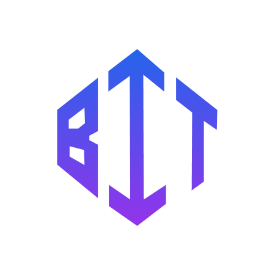

# BitStream - Complete Responsive Web Application

<div align="center">
  
  
  ### Building scalable mobile & web solutions
  
  [](https://nextjs.org/)
  [](https://www.typescriptlang.org/)
  [](https://tailwindcss.com/)
  [](LICENSE)
</div>

## 🚀 Overview

BitStream is a modern, high-performance responsive web application built with Next.js, showcasing software development services and projects. It features a beautiful glassmorphism design, dynamic project portfolios, interactive testimonials, contact management, comprehensive authentication, and database integration.

### ✨ Live Demo

Visit our live site: [bitstreamhq.com](https://bitstreamhq.com)

### 🎯 Featured Projects

- **[UniRide](https://bitstreamhq.com/projects/uniride)** - Campus ride-sharing platform with real-time matching and interactive testimonials

## 🎯 Features

### 🖥️ Frontend

- **Next.js 15** with App Router
- **TypeScript** for type safety
- **Tailwind CSS** with custom animations
- **Glassmorphism UI** with modern design
- **Responsive Design** (mobile-first approach)
- **Accessibility Compliant** (WCAG guidelines)

### 🔐 Authentication & Database

- **NextAuth.js** for authentication
- **MongoDB** database integration
- **Cloudinary** for image management
- **SendGrid** for email services

### 🧪 Testing & Quality

- **Jest** with React Testing Library
- **ESLint** and **Prettier** configuration
- **Husky** git hooks with lint-staged
- **TypeScript** strict mode
- **Test coverage** reporting

### 📧 Communication

- Contact form with email integration
- Newsletter signup functionality
- Health check API endpoint

## 🛠️ Tech Stack

| Category           | Technologies                                     |
| ------------------ | ------------------------------------------------ |
| **Frontend**       | React 18, Next.js 15, TypeScript, Tailwind CSS   |
| **Styling**        | Tailwind CSS, Lucide React Icons, CSS Animations |
| **Authentication** | NextAuth.js                                      |
| **Database**       | MongoDB                                          |
| **Email**          | SendGrid                                         |
| **File Upload**    | Cloudinary                                       |
| **Testing**        | Jest, React Testing Library                      |
| **Code Quality**   | ESLint, Prettier, Husky                          |
| **Deployment**     | Vercel Ready                                     |

## 📦 Quick Start

### Prerequisites

- Node.js 18+
- npm, yarn, or pnpm
- MongoDB database
- Git

### Installation

1. **Clone the repository**

   ```bash
   git clone https://github.com/your-username/bitstream.git
   cd bitstream
   ```

2. **Install dependencies**

   ```bash
   npm install
   # or
   yarn install
   # or
   pnpm install
   ```

3. **Set up environment variables**

   ```bash
   cp .env.example .env.local
   ```

4. **Configure your environment variables**

   ```env
   # Database
   MONGODB_URI=mongodb://localhost:27017/bitstream

   # Authentication
   NEXTAUTH_URL=http://localhost:3000
   NEXTAUTH_SECRET=your-secret-key

   # Email (SendGrid)
   SENDGRID_API_KEY=your-sendgrid-api-key
   FROM_EMAIL=official.bitstream@gmail.com

   # Cloudinary
   CLOUDINARY_CLOUD_NAME=your-cloud-name
   CLOUDINARY_API_KEY=your-api-key
   CLOUDINARY_API_SECRET=your-api-secret

   # App Configuration
   NEXT_PUBLIC_APP_URL=http://localhost:3000
   ```

5. **Run the development server**

   ```bash
   npm run dev
   # or
   yarn dev
   # or
   pnpm dev
   ```

6. **Open your browser**

   Navigate to [http://localhost:3000](http://localhost:3000)

## 📁 Project Structure

```
bitstream/
├── app/                    # Next.js App Router
│   ├── globals.css        # Global styles & animations
│   ├── layout.tsx         # Root layout
│   ├── page.tsx          # Home page
│   ├── about/            # About page
│   ├── blog/             # Blog section
│   ├── contact/          # Contact page
│   ├── projects/         # Projects showcase
│   ├── services/         # Services page
│   └── api/              # API routes
│       └── health/       # Health check endpoint
├── components/           # Reusable components
│   ├── layout/          # Layout components
│   │   ├── header.tsx   # Site header
│   │   └── footer.tsx   # Site footer
│   ├── sections/        # Page sections
│   │   ├── hero.tsx     # Hero section
│   │   ├── projects.tsx # Projects section
│   │   └── services.tsx # Services section
│   └── ui/              # UI components
│       ├── button.tsx   # Button component
│       ├── card.tsx     # Card component
│       ├── navbar.tsx   # Navigation bar
│       └── footer.tsx   # Footer component
├── lib/                 # Utility libraries
│   ├── auth.ts         # Authentication config
│   ├── constants.ts    # App constants
│   ├── db.ts          # Database connection
│   └── utils.ts       # Utility functions
├── public/            # Static assets
│   ├── icons/         # App icons
│   └── images/        # Images
├── __tests__/         # Test files
├── scripts/           # Build scripts
└── styles/           # Additional styles
```

## 🎨 Design System

### Color Palette

- **Primary**: Blue gradient (#3B82F6 to #1E40AF)
- **Secondary**: Purple gradient (#8B5CF6 to #6366F1)
- **Accent**: Cyan (#06B6D4)
- **Neutral**: Gray scale (#F9FAFB to #111827)

### Typography

- **Headings**: Inter (font-weight: 600-800)
- **Body**: Inter (font-weight: 400-500)
- **Code**: JetBrains Mono

### Animations

- Glassmorphism effects with backdrop blur
- Smooth hover transitions (300ms)
- Staggered entrance animations
- 60fps optimized transforms

## 🧪 Testing

### Run Tests

```bash
# Run all tests
npm run test

# Run tests in watch mode
npm run test:watch

# Generate coverage report
npm run test:coverage
```

### Test Structure

- **Unit Tests**: Components and utilities
- **Integration Tests**: Page components
- **Coverage**: Minimum 80% coverage target

## 📱 Pages & Features

### 🏠 Home Page

- Hero section with animated background
- Services overview with interactive cards
- Featured projects showcase
- Call-to-action sections

### 📋 Services Page

- Web Development
- Mobile Development
- Backend Development
- DevOps & Deployment
- AI Integration
- UI/UX Design

### 🚀 Projects Page

- Featured project portfolio
- Project statistics and metrics
- Technology stack showcase
- Case studies and demos

### 📞 Contact Page

- Contact form with validation
- Email integration via SendGrid
- Business information
- Social media links

### ℹ️ About Page

- Company information
- Team showcase
- Mission and values
- Technology expertise

## 🔧 Development Scripts

```bash
# Development
npm run dev          # Start development server
npm run build        # Build for production
npm run start        # Start production server

# Code Quality
npm run lint         # Run ESLint
npm run lint:fix     # Fix ESLint errors
npm run type-check   # Run TypeScript checks
npm run prettier     # Format code
npm run prettier:check # Check formatting

# Testing
npm run test         # Run tests
npm run test:watch   # Run tests in watch mode
npm run test:coverage # Generate coverage report
```

## 🚀 Deployment

### Vercel (Recommended)

1. Push your code to GitHub
2. Connect your repository to Vercel
3. Set environment variables in Vercel dashboard
4. Deploy automatically on every push

### Manual Deployment

```bash
# Build the application
npm run build

# Start the production server
npm run start
```

## 🔐 Environment Variables

Create a `.env.local` file with the following variables:

```env
# Required
MONGODB_URI=
NEXTAUTH_URL=
NEXTAUTH_SECRET=

# Email (Optional)
SENDGRID_API_KEY=
FROM_EMAIL=

# Cloudinary (Optional)
CLOUDINARY_CLOUD_NAME=
CLOUDINARY_API_KEY=
CLOUDINARY_API_SECRET=

# App Configuration
NEXT_PUBLIC_APP_URL=
```

## 🤝 Contributing

We welcome contributions! Please follow these steps:

1. Fork the repository
2. Create a feature branch (`git checkout -b feature/amazing-feature`)
3. Make your changes
4. Run tests (`npm run test`)
5. Commit your changes (`git commit -m 'Add amazing feature'`)
6. Push to the branch (`git push origin feature/amazing-feature`)
7. Open a Pull Request

### Development Guidelines

- Follow TypeScript best practices
- Write tests for new features
- Use conventional commit messages
- Ensure all tests pass
- Follow existing code style

## 📄 License

This project is licensed under the MIT License - see the [LICENSE](LICENSE) file for details.

## 🙏 Acknowledgments

- [Next.js](https://nextjs.org/) - The React framework
- [Tailwind CSS](https://tailwindcss.com/) - Utility-first CSS framework
- [Vercel](https://vercel.com/) - Deployment platform
- [Lucide](https://lucide.dev/) - Beautiful icons

## 📞 Support & Contact

- **Email**: [official.bitstream@gmail.com](mailto:official.bitstream@gmail.com)
- **Website**: [bitstreamhq.com](https://bitstreamhq.com)
- **Response Time**: Within 24 hours
- **Support**: 24/7 Available

---

<div align="center">
  <p><strong>BitStream</strong> - Building scalable mobile & web solutions</p>
  <p>Made with ❤️ by the BitStream team</p>
</div>
